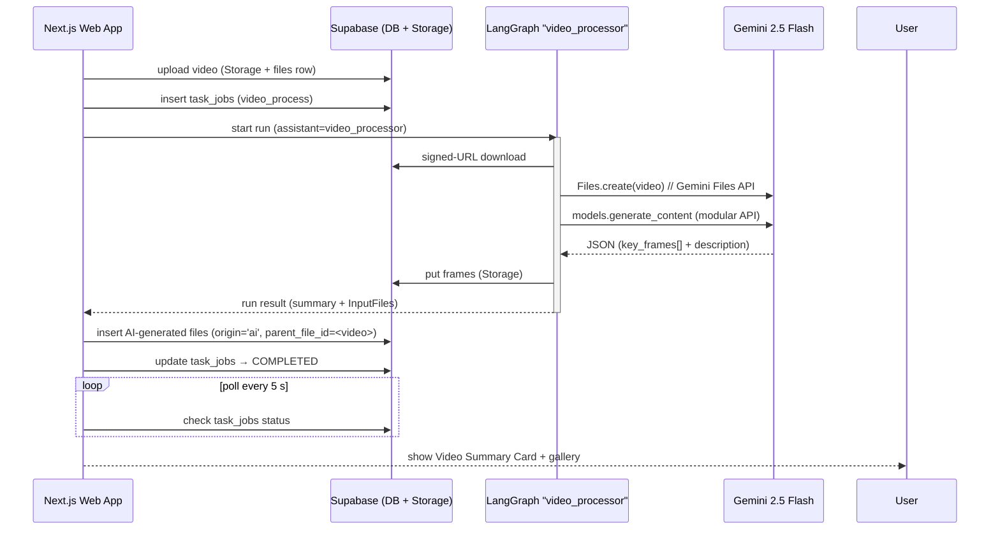

# Video Integration – End‑to‑End Implementation Plan

## 1 · Description

This document specifies the complete design for **uploading, processing, and surfacing walkthrough video content** inside the Contractor‑App.  The goal is to let contractors record a site walkthrough, upload the video, and automatically obtain:

* **A rich, referenceable summary** that quotes narration and points to key visual moments
* **Key‑frame screenshots** (10–20 images) with timestamps + captions
* Artefacts stored as project files so downstream estimate generation can consume them
* A clean UI that shows a *Video Summary Card* without polluting the normal **Files** list

The solution reuses the existing pattern: **Web UI ↔ Supabase ↔ LangGraph**, but introduces a new BAML function (`AnalyzeVideo`) and a dedicated LangGraph workflow (`video_processor`).

---

## 2 · High‑Level Flow



---

## 3 · Database Schema Updates

| Table          | Change                                                                                                                                                                    |
| -------------- | ------------------------------------------------------------------------------------------------------------------------------------------------------------------------- |
| **files**      | `origin TEXT DEFAULT 'user'` & `parent_file_id UUID REFERENCES files(id)`<br> (`origin='ai'` for summary + frames, `parent_file_id` links them to the original video row) |
| **task\_jobs** | Extend enum `job_type` → add `'video_process'`                                                                                                                            |

Indexes:

```sql
CREATE INDEX IF NOT EXISTS files_parent_idx ON files(parent_file_id);
```

No RLS adjustments required—the new rows inherit the project‑scoped policies already in place.

---

## 4 · BAML Additions (`baml_src/video.baml`)

```baml
class KeyFrame:
  filename: str      # e.g. "frame_03.png"
  description: str   # caption of visual detail
  timestamp_s: float # seconds from start

class VideoAnalysis:
  key_frames: KeyFrame[]
  detailed_description: str

fn AnalyzeVideo(video_reference: str) -> VideoAnalysis
  """
  You are a construction‑estimation assistant…
  1. Select the 10–20 most informative frames.
  2. Return JSON exactly matching the schema.
  3. In detailed_description, quote user narration and reference the frame filenames.
  """
client GeminiFlash2_5
```

Run codegen: `pnpm baml generate` → refresh TS + Python clients.

---

## 5 · LangGraph Workflow (`video_processor`)

### 5.1 State Model

```python
@dataclass
class VideoState:
    project_id: str
    video_file: InputFile       # signed URL + metadata from Next
    analysis: VideoAnalysis | None = None
    extracted_frames: list[InputFile] = field(default_factory=list)
```

### 5.2 Nodes

| Node                 | Responsibility                                                                                      |
| -------------------- | --------------------------------------------------------------------------------------------------- |
| **`analyze_video`**  | Upload to Gemini Files API ➜ call `AnalyzeVideo` via modular API ➜ parse `VideoAnalysis`            |
| **`extract_frames`** | For each `key_frame`, run `ffmpeg -ss {ts} -i video -vframes 1 {filename}` ➜ upload PNGs to Storage |
| **`return_results`** | Return `VideoProcessingResult` containing `detailed_description` and `InputFile[]` for all frames   |

### 5.3 Graph

```python
graph = StateGraph(VideoState)
graph.add_node("analyze_video", analyze_video)
graph.add_node("extract_frames", extract_frames)
graph.set_entry_point("analyze_video")
graph.connect("analyze_video", "extract_frames")
video_processor = graph.compile()
```

Expose via the existing LangGraph HTTP router as `assistant_id = "video_processor"`.

**Secrets**: LangGraph container needs `GEMINI_API_KEY` + *storage‑only* Supabase JWT (no full service key).

---

## 6 · Next.js Server Actions

### 6.1 `startVideoProcessing(projectId, fileId)`

1. Fetch file row & create 1‑hour signed URL.
2. POST `/threads` then `/threads/{id}/runs` with:

```json
{
  "assistant_id": "video_processor",
  "input": {
    "project_id": "…",
    "video_file": { … }
  }
}
```

3. Insert `task_jobs` row `{job_type: 'video_process', status:'processing'}`.

### 6.2 `checkVideoProcessingStatus(projectId)`

* Poll every 5 s. When run completes:

  * Receive `VideoProcessingResult` JSON from LangGraph.
  * **Upload** `detailed_description` as `.txt` to Storage.
  * **Bulk‑insert** rows in `files` table for summary + each frame → set `origin='ai'`, `parent_file_id=<video>`.
  * Update `task_jobs.status = 'completed'` and persist any error if failed.

---

## 7 · UI / UX

### 7.1 Files Page Filter

* Default query: `origin = 'user' AND parent_file_id IS NULL`.
* Toggle **“Show AI‑generated files”** ➜ reveals frames / summary.

### 7.2 Video Summary Card

* Located in Project > Files > click original video.
* Fetch children `parent_file_id = <videoId>`.
* Render:

  * **Summary text** (markdown)
  * **Frame gallery** grid (caption below each image)
  * Checkbox list → “Include in estimate” (sets `ignored` flag if needed)

### 7.3 Progress Indicators

* Chips in Files list:

  * ⏳ *Processing video*
  * ✅ *Summary ready*
  * ❌ *Processing failed*

---


### 📌  Done → Contractors can now upload walkthrough videos, receive a narrated summary plus key screenshots, and feed that data straight into the AI estimate generator without cluttering their normal file list.

---

## 11 · Appendix – Using the Gemini Modular API

> **Context:** BAML does not (yet) let you pass binary video objects directly. Instead you:
>
> 1. Upload the raw video to the **Files API** → you receive a `file.name` (URI).
> 2. Build the modular‑API request body that BAML generated for you (it already contains the textual prompt + safety settings).
> 3. Pre‑pend a manual *file reference* stanza to the `contents` array.
> 4. Call `models.generate_content`.
> 5. Pipe the response through `b.parse.<Fn>` to get strong‑typed output.

### 11.1 Uploading a video with the Files API

```python
import os, aiofiles
from pathlib import Path
from google import genai

gem = genai.Client(api_key=os.environ["GEMINI_API_KEY"])

async def upload_video_to_gemini(local_path: str) -> str:
    """Return a gemini_file: URI suitable for prompts."""
    async with aiofiles.open(local_path, "rb") as f:
        res = await gem.aio.files.create(
            file=await f.read(),
            mime_type="video/mp4",
            display_name=Path(local_path).name,
        )
    return f"gemini_file:{res.name}"
```

### 11.2 Building and sending the modular request

```python
from baml_client_py import b  # auto‑generated client

async def run_analyze_video(video_uri: str) -> b.VideoAnalysis:
    # ➊ Generate the **request stub** (prompt + safety) from BAML
    req = await b.request.AnalyzeVideo(video_reference=video_uri)
    body = req.body.json()

    # ➋ Pre‑pend the video reference to the *contents* list
    body["contents"].insert(0, {
        "fileUri": video_uri,
        "mimeType": "video/mp4"
    })

    # ➌ Send to Gemini 2.5 Flash (streaming or standard)
    resp = await gem.aio.models.generate_content(
        model="gemini-2.5-flash-latest",
        contents=body["contents"],
        config={"safety_settings": [body["safetySettings"]]},
    )

    # ➍ Parse into a strongly‑typed object
    analysis = b.parse.AnalyzeVideo(resp.text)
    return analysis
```

### 11.3 End‑to‑end helper inside LangGraph

```python
async def analyze_and_extract(local_mp4: Path) -> VideoAnalysis:
    uri = await upload_video_to_gemini(local_mp4)
    analysis = await run_analyze_video(uri)
    return analysis  # Ready for downstream frame‑extraction node
```

**Tip – Rate limits:** The Files API allows \~60 uploads per minute.  Cache the `gemini_file:` URI inside your job state so retries don’t re‑upload.

---
