# Video Integration – End‑to‑End Implementation Plan

## 0. Status & Implementation Notes (NEW SECTION)

*   **Overall LangGraph Status:** The LangGraph `video_processor` workflow (Sections 4 & 5) is **IMPLEMENTED and TESTED**.
*   **Next.js Server Actions (Section 6):** The core server actions (`uploadFile` modifications, `startVideoProcessing`, `checkVideoProcessingStatus`) are **IMPLEMENTED**. Video processing is automatically triggered by `uploadFile` for video files.
*   **Filename Conventions:**
    *   Original video files retain their names in the DB, but use a sanitized, timestamped name for Supabase storage path upon initial upload by user.
    *   AI-generated summary text file is named `video_summary_{sanitized_original_video_filename_base}.txt`.
    *   AI-generated frame images use their BAML-defined names (e.g., `frame_01.png`).
    *   Storage path for AI-generated content: `{projectId}/ai_generated/{originalVideoFileId}/{filename}`.
*   **BAML:** Implemented within `baml_src/file_processor.baml`.
*   **Gemini API Usage:** Uses the `google-generativeai` Python SDK, including polling for video "ACTIVE" state and a modular approach for content generation with BAML.
*   **Supabase Client:** Uses the official `supabase` Python library (async client) in LangGraph, and the standard Supabase JS client in Next.js server actions.
*   **Logging:** Python `logging` in LangGraph; `console.log/error` in Next.js actions.
*   **LangGraph Output:** The `video_processor` graph returns a dictionary containing `analysis: VideoAnalysis`, `extracted_frames: InputFile[]`, and `parent_file_id: string`, `project_id: string` directly at the root of the output object from the `/join` endpoint.
*   **Secrets:** LangGraph needs `GOOGLE_API_KEY`, `SUPABASE_URL`, `SUPABASE_KEY`. Next.js needs `SUPABASE_URL`, `SUPABASE_SERVICE_KEY` (or anon key depending on setup), `LANGGRAPH_API_URL`, `LANGGRAPH_API_KEY`.

## 1 · Description

This document specifies the complete design for **uploading, processing, and surfacing walkthrough video content** inside the Contractor‑App.  The goal is to let contractors record a site walkthrough, upload the video, and automatically obtain:

* **A rich, referenceable summary** that quotes narration and points to key visual moments
* **Key‑frame screenshots** (10–20 images) with timestamps + captions
* Artefacts stored as project files so downstream estimate generation can consume them
* A clean UI that shows a *Video Summary Card* without polluting the normal **Files** list

The solution reuses the existing pattern: **Web UI ↔ Supabase ↔ LangGraph**, but introduces a new BAML function (`AnalyzeVideo`) and a dedicated LangGraph workflow (`video_processor`).

---

## 2 · High‑Level Flow

```mermaid
sequenceDiagram
    participant Web as Next.js Web App
    participant SB as Supabase (DB + Storage)
    participant LG as LangGraph "video_processor"
    participant GEM as Gemini API (Files + Model)
    Web->>SB: upload video  (Storage + files row with video metadata)
    Web->>SB: insert task_jobs (job_type='video_process', status='processing', file_id=<original_video_file_id>)
    Web->>LG: start run (assistant_id="video_processor", input={project_id, video_file: {name, type, download_url}})
    activate LG
    LG->>SB: signed‑URL download (original video using video_file.download_url)
    LG->>GEM: client.files.upload(video_bytes) // Gemini Files API
    Note over LG,GEM: Poll video_file.state until "ACTIVE"
    LG->>GEM: model.generate_content_async(contents=[GeminiFile, BAML_prompt_parts]) // Modular API with BAML
    GEM-->>LG: JSON (VideoAnalysis: {detailed_description, key_frames[]})
    Note over LG: For each key_frame in VideoAnalysis:
    LG->>Local: ffmpeg extracts frame from local video copy
    LG->>SB: supabase_client.storage.upload(frame_bytes to project_id/frames/)
    LG-->>Web: run result ("analysis": {detailed_description: "description of video"}, "extracted_frames": InputFile[] with path to file saved in download_url field)
    deactivate LG
    Web->>SB: insert AI‑generated files (origin='ai', parent_file_id=<video_id>, detailed_description.txt and each frame.png)
    Web->>SB: update task_jobs.status → 'completed' (or 'failed')
    loop poll every 5 s
        Web->>SB: check task_jobs status
    end
    Web-->>User: show Video Summary Card + gallery
```


**Status:** Overall flow remains valid. LangGraph part implemented.

---

## 3 · Database Schema Updates (FINISHED)

| Table          | Change                                                                                                                                                                    |
| -------------- | ------------------------------------------------------------------------------------------------------------------------------------------------------------------------- |
| **files**      | `origin TEXT DEFAULT 'user'` & `parent_file_id UUID REFERENCES files(id)`<br> (`origin='ai'` for summary + frames, `parent_file_id` links them to the original video row) |


Indexes:

```sql
CREATE INDEX IF NOT EXISTS files_parent_idx ON files(parent_file_id);
```
**Status:** SQL provided. User to apply to their database. (User confirmed `job_type` is TEXT, so enum change might not be needed).

---

## 4 · BAML Additions (`baml_src/file_processor.baml`)

**Status: Implemented in `baml_src/file_processor.baml`**

The following classes and function were added to `baml_src/file_processor.baml`:

```baml
// In baml_src/file_processor.baml

class KeyFrame {
  filename string @description("Filename of the frame")
  timestamp_s float @description("Timestamp of the frame in seconds from the start of the video")
  description string @description("Detailed description of the frame and its relevance to the project")
}

class VideoAnalysis {
  detailed_description string @description("A detailed summary of the video content, quoting user narration if present, and referencing key frame filenames to illustrate points. This description should be comprehensive enough for a downstream estimator to understand the video's content without watching it.")
  key_frames KeyFrame[] @description("A list of 10-20 key frames that capture the most informative visual details from the video relevant to project estimation.")
}

function AnalyzeVideo(video_reference: string) -> VideoAnalysis {
  client GeminiProcessor // Assumes GeminiProcessor is configured for a capable Gemini model
  prompt #"
  You are a construction-estimation assistant. You are given a reference to a video walkthrough of a project site.
  Your task is to analyze the video thoroughly and extract key visual information and spoken narration to aid in project estimation.

  The video reference is: {{ video_reference }} // This will be the Gemini File API URI

  Follow these instructions carefully:
  1. Identify and select between 10 to 20 key frames from the video that are most informative for understanding the project scope, existing conditions, materials, and potential challenges.
     For each key frame, provide:
     - A descriptive `filename` (e.g., "frame_01.png", "frame_02.png", ...).
     - The `timestamp_s` in seconds from the beginning of the video where the frame occurs.
     - A detailed `description` of what is visually depicted in the frame and its significance to the project. Note any specific items, conditions, or measurements visible.

  2. Create a `detailed_description` of the entire video. This should be a narrative summary that:
     - Integrates information from both the visual content and any spoken narration in the video.
     - Quotes important phrases from the user's narration, if any.
     - References the `filename` of the key frames you selected to illustrate specific points in your summary (e.g., "As seen in frame_03.png, the northern wall shows signs of water damage...").
     - Is comprehensive enough that a downstream estimator, who will *not* see the video, can understand the project's key aspects.

  3. Return your analysis as a JSON object that strictly adheres to the `VideoAnalysis` schema, containing `detailed_description` and the list of `key_frames`.

  {{ ctx.output_format }}
  "#
}
```

Run codegen: `pnpm baml generate` → refresh TS + Python clients. (Implemented)

---

## 5 · LangGraph Workflow (`video_processor`)

**Status: Implemented in `apps/langgraph/src/file_processor/video_graph.py`**

### 5.1 State Model (`apps/langgraph/src/file_processor/state.py`)

```python
# From apps/langgraph/src/file_processor/state.py
from .baml_client.types import InputFile, VideoAnalysis # (and other imports)

@dataclass
class VideoState:
    """Defines the state for the video processing workflow."""
    project_id: str
    video_file: InputFile  # Contains original filename, type, and signed download_url from Next.js
    analysis: Optional[VideoAnalysis] = None # Populated by analyze_video_node
    extracted_frames: list[InputFile] = field(default_factory=list) # Populated by extract_frames_node
    # Temporary path for the downloaded video file, used across nodes.
    local_video_path: Optional[str] = None 

```

### 5.2 Nodes (`apps/langgraph/src/file_processor/video_graph.py`)

| Node                 | Responsibility                                                                                                                                                                                             | Implementation Notes                                                                                                                               |
| -------------------- | ---------------------------------------------------------------------------------------------------------------------------------------------------------------------------------------------------------- | -------------------------------------------------------------------------------------------------------------------------------------------------- |
| **`analyze_video_node`** | Downloads video using `video_file.download_url` ➜ Uploads to Gemini Files API (via `GENAI_CLIENT.files.upload()`), polls until "ACTIVE" ➜ Calls BAML-backed `run_analyze_video_baml` ➜ Stores `VideoAnalysis` and `local_video_path`, `gemini_video_file_obj`. | Uses `aiohttp` for download, `google-generativeai` for Gemini. `run_analyze_video_baml` implements modular Gemini call.                         |
| **`extract_frames_node`** | For each `key_frame` in `VideoAnalysis`, uses `ffmpeg` (via `asyncio.subprocess`) to extract frame from `local_video_path` ➜ Uploads PNG to Supabase Storage (via official `supabase` async client) ➜ Creates `InputFile` list. | Stores Supabase filepath in `InputFile.download_url`.                                                                                         |                                                      |


---

## 6 · Next.js Server Actions

**Status: To be implemented.**

### 6.1 `startVideoProcessing(projectId, fileId)`

1. Fetch `files` row for `fileId` (this is the original video uploaded by user).
2. Create a 1‑hour signed URL for the video file stored in Supabase Storage.
3. Call LangGraph service:
   * POST `/threads` (standard LangGraph endpoint) to create a new thread.
   * POST `/threads/{thread_id}/runs` with:
    ```json
    {
      "assistant_id": "video_processor",
      "input": {
        "project_id": "PROJECT_ID_FROM_ARG",
        "video_file": {
          "name": "FILE_NAME_FROM_DB",
          "type": "VIDEO_MIME_TYPE_FROM_DB",
          "download_url": "SIGNED_URL_CREATED_IN_STEP_2"
        }
      }
    }
    ```
4. Insert `task_jobs` row: `{job_type: 'video_process', status:'processing', project_id: projectId, file_id: fileId, run_id: LG_RUN_ID, thread_id: LG_THREAD_ID}`.

### 6.2 `checkVideoProcessingStatus(jobId)` (or `(projectId, originalFileId)`)

*   Poll this action every 5 s from the UI if a video processing job is active.
*   Takes `jobId` (from `task_jobs`).
*   **LangGraph Interaction:** This action will call a LangGraph status endpoint for the `run_id` and `thread_id` associated with the `jobId` to get the run's current status and output.
    *   GET `/threads/{thread_id}/runs/{run_id}`
*   **On Completion:**
    *   If LangGraph run succeeded:
        *   Receive the `final_output` (containing `detailed_description` and `frames: InputFile[]`) from LangGraph.
        *   **Upload `detailed_description` as `summary.txt` to Supabase Storage** under a path like `{projectId}/ai_generated/{originalVideoFileId}/summary.txt`. Get its public/signed URL.
        *   **Bulk‑insert rows in `files` table:**
            *   One for the summary: `name='summary.txt'`, `description='AI-generated video summary'`, `file_url=<summary_storage_url>`, `origin='ai'`, `parent_file_id=<originalVideoFileId>`.
            *   One for each frame in `final_output.frames`: Use `InputFile.name` (e.g., `frame_01.png`), `InputFile.description`, `file_url=<InputFile.download_url_from_LG>`, `origin='ai'`, `parent_file_id=<originalVideoFileId>`.
        *   Update `task_jobs.status = 'completed'`, store LangGraph output (`final_output`) in `task_jobs.result_data` (JSONB).
    *   If LangGraph run failed:
        *   Update `task_jobs.status = 'failed'`, store error details in `task_jobs.result_data`.

---

## 7 · UI / UX

**Status: To be implemented.**

### 7.1 Files Page Filter

*   Default query for files list: `SELECT * FROM files WHERE project_id = :currentProjectId AND origin = 'user' AND parent_file_id IS NULL`.
*   Add a toggle (e.g., checkbox "Show AI‑generated files") that, when checked, changes the query or filters client-side to also include files where `origin = 'ai'` for the current project (or specifically related to visible parent files).

### 7.2 Video Summary Card

*   When a user clicks on an original video file (one that has `task_jobs` entries for `video_process`):
    *   Check `task_jobs` status.
        *   If `processing`: Show "Processing video..."
        *   If `failed`: Show "Processing failed. [Retry button?]"
        *   If `completed`:
            *   Fetch child files: `SELECT * FROM files WHERE parent_file_id = :originalVideoFileId AND origin = 'ai' ORDER BY name`. This gets the summary text file and all frame image files.
            *   Render:
                *   **Summary text:** Load content from the `summary.txt` file's URL. Display as markdown.
                *   **Frame gallery:** For each frame image file, display the image (using its `file_url`) with its `description` as a caption.
                *   (Optional) Checkbox list alongside frames: "Include in estimate" – this could set an `ignored_by_user: boolean` flag on the `files` row for that frame, to be considered by `GenerateProjectEstimate` BAML function if it's adapted to filter files.

### 7.3 Progress Indicators

*   In the main Files list, next to video files that have been sent for processing:
    *   Display a chip or icon based on `task_jobs.status`:
        *   ⏳ *Processing video* (when `status='processing'`)
        *   ✅ *Summary ready* (when `status='completed'`)
        *   ❌ *Processing failed* (when `status='failed'`)

---

## 11 · Appendix – Using the Gemini API with BAML Client

**Status: Updated to reflect current implementation in `video_graph.py`.**

> **Context:** The BAML `AnalyzeVideo` function is designed to take a `video_reference` (Gemini File API URI). The LangGraph workflow handles the initial video upload to the Gemini Files API and then passes this reference to BAML. BAML helps structure the prompt and parse the LLM's response.

### 11.1 Uploading a video with the Gemini Files API & Polling (in `video_graph.py`)

The `upload_video_to_gemini` helper function in `video_graph.py` uses `google.generativeai` client:

```python
# Simplified from video_graph.py
import asyncio
import aiofiles
from google.generativeai import GenerativeServiceClient, File # Using File type hint
import google.generativeai as genai # For client configuration
# GENAI_CLIENT = GenerativeServiceClient() # Initialized once

async def upload_video_to_gemini(local_path: str) -> File: # Returns Gemini File object
    """Uploads a local video file to Gemini Files API, polls until active, and returns the File object."""
    logger.info(f"Uploading {local_path} to Gemini Files API.")
    async with aiofiles.open(local_path, "rb") as f:
        video_file_obj: File = await GENAI_CLIENT.files.upload(file=f) 
    
    logger.info(f"Uploaded to Gemini: {video_file_obj.uri} ..., initial state: {video_file_obj.state.name ...}")

    while not video_file_obj.state or video_file_obj.state.name != "ACTIVE":
        logger.info(f"Processing video {video_file_obj.name}... Current state: {video_file_obj.state.name ...}. Polling ...")
        await asyncio.sleep(5) 
        video_file_obj = await GENAI_CLIENT.files.get(name=video_file_obj.name)

    logger.info(f"Video {video_file_obj.name} is now ACTIVE...")
    return video_file_obj
```

### 11.2 Building and sending the modular request (in `run_analyze_video_baml` from `video_graph.py`)

The `run_analyze_video_baml` function in `video_graph.py` demonstrates the modular call:

```python
# Simplified from video_graph.py
from apps.langgraph.src.file_processor.baml_client import b
from apps.langgraph.src.file_processor.baml_client.types import VideoAnalysis
from google.generativeai.types import File as GeminiFile

async def run_analyze_video_baml(video_file: GeminiFile) -> VideoAnalysis:
    """Calls the Gemini API using a modular approach with BAML request/response parsing."""
    logger.info(f"Starting modular Gemini call for video {video_file.uri} using BAML schema...")

    # 1. Get BAML request components (prompt parts, safety settings)
    baml_req_obj = await b.request.AnalyzeVideo(video_reference=video_file.uri)
    body_dict = baml_req_obj.body.json() 
    prompt_text_parts = body_dict.get("contents", []) # BAML prompt content
    final_safety_settings = body_dict.get("safetySettings") # Adapt as needed

    # 2. Construct final API contents: Prepend GeminiFile object to BAML prompt parts
    final_api_contents = [video_file] + prompt_text_parts

    # 3. Send to Gemini model (e.g., "models/gemini-1.5-flash-latest")
    # model_instance = GENAI_CLIENT.get_model("models/gemini-1.5-flash-latest") 
    # gemini_response = await model_instance.generate_content_async(
    #     contents=final_api_contents,
    #     safety_settings=final_safety_settings 
    # )
    # (Error handling and response extraction as implemented) ...
    response_text = "..." # Extracted text from gemini_response

    # 4. Parse into a strongly‑typed BAML object
    analysis_result = b.parse.AnalyzeVideo(response_text)
    return analysis_result
```

### 11.3 End‑to‑end graph node (`analyze_video_node` in `video_graph.py`)

The `analyze_video_node` in the LangGraph workflow orchestrates these steps:
1.  Downloads the original video (e.g., from Supabase signed URL).
2.  Calls `upload_video_to_gemini` to upload it to Gemini Files API and get the processed `GeminiFile` object.
3.  Calls `run_analyze_video_baml` with the `GeminiFile` object.
4.  Updates the `VideoState` with the `VideoAnalysis` result and other necessary paths/objects.

**Tip – Rate limits:**  The Files API allows a certain number of uploads per minute. The current implementation uploads once per video processing run. Caching the `GeminiFile` object or its URI within the `VideoState` (as `gemini_video_file_obj`) helps if retries or further operations are needed on the same Gemini file within the same graph run.

---
### 📌  LangGraph portion for video processing is implemented. Next steps involve Next.js server actions and UI updates.
